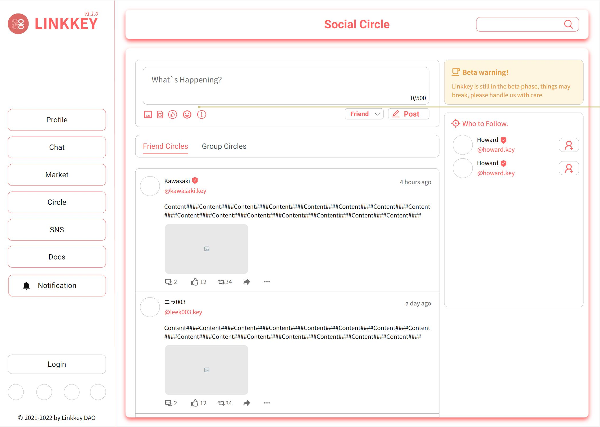

# Circle

**Comming soon!**

Based on Follow-NFT and Group-NFT, we will introduce the function of Social Circle.

Social Circle is a kind of social interaction circle between specific people (who hold your exclusive NFT), you can post articles to share your thoughts, and people who hold your NFT can see your post and comment and like and repost it. You can pass your NFT to others who will enter your social circle, or you can put your NFT for sale on the trading market, and those who buy your NFT will become part of your social circle.

We plan to launch the Social Circle section in 2022Q4, and we have deeply investigated the Lens Protocol protocol, which is more suitable as our base module solution to implement Social circle, but of course it is not 100% sure. We can't confirm whether Lens has strong extensibility, if Lens can't meet our needs, we will find another solution or even implement the underlying module by ourselves.

Below we have a brief functional explanation of the Social Circle board from the prototype:

The overall layout of the Social Circle is a conventional social media format, building a small social interaction around the Post, the social circle is divided into two categories: Friends & Groups, and users can choose the scope of Post posting:

- Post to the friends circle will only be visible among friends
- Post to the specified group circle will only be visible to members of the specified group

In addition, Social circle supports building on-chain voting, which can be done by voters with only wallet signature and no gas overhead.

Of course, we also provide the function of Friends & Groups discovery in the right sidebar, click the Add button to go to the specified purchase page, after purchasing the relevant NFT will become a friend or join the group.
