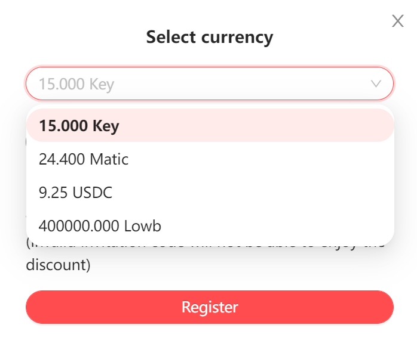

# About SNS Register

## 3-digit registration

### Pricing
Currently two tokens are supported, Matic and KEY, with the following pricing:
- 200 Matic
- 300 KEY

> 3-digit registration did not implement the logic of price increase

### Invitation mechanism

Currently 3-digit registration does not support invitation, we will add the invitation mechanism in the next version

## 4-digit and above registration

### Pricing

Currently supporting multi-currency registrations, including Matic/KEY/USDC/LOWB, their pricing strategy is as follows:

- 10 Matic (for every 100 new registrations, the price increases by 0.3 Matic)
- ~~15 KEY (Temporarily closed)~~
- 8 USDC (price increase of 0.25 USDC for every 100 new registrations)
- ~~400000 Lowb(Temporarily closed)~~

Currently, the registration prices for each currency are as follows: 

## Invitation to Rebate

After becoming an invitee, if a new user uses your domain name as the invitation code for registration, you will get 10% registration fee share, which is directly split through the contract, while new users can enjoy 10% registration discount.

Invitation rebate mechanism supports 3-digit and above domain name registration

## Weekly Discount
Every week on Thu and Fri (0:00-24:00 UTC), all domain registration fees are 50% off, stackable with invite offer
