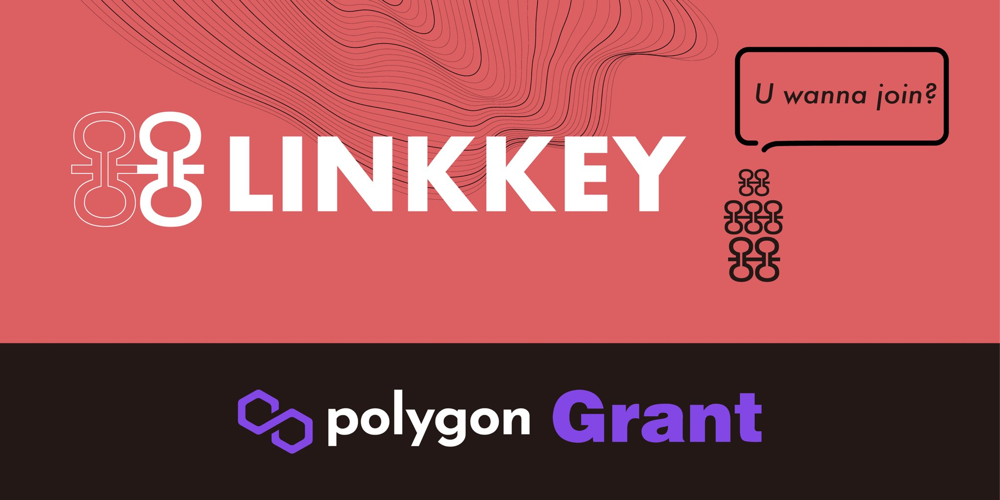

# Introduction

LINKKEY is a universal protocol for building WEB3 social circles, SNS personal domain name service to create a social circle identity system, Follow/Group-NFT contract to define the relationship between friends and groups, LINKCHAT to achieve encrypted communication between friends & groups, LINKPOST to build a social circle interaction between friends.

Linkkey received an [official Grant from Polygon](https://twitter.com/Polygon_Space1/status/1472628456471302144) in the end of 2021, and Polygon provided us with a series of assistance to successfully incubate Linkkey as the #1 ranked Polygon Chain Domain Web3 project category.

Since September 2021, our core team has been discussing the SocialFi opportunity internally, and through almost weekly offline sharing discussions, we finally agreed on the direction to use web3 personal social domains (SNS - Social Name System) as the entry point We then used SNS as the Web3 identity carrier to open decentralized private circle chatting and social interaction based on the NFT holding relationship between SNS social domains by issuing exclusive NFTs.

In a word, we are trying to build a blockchain-based, completely decentralized Web3 private social circle. This will bring a private social network with autonomous control and censorship resistance to the citizens of Web3. It is not built for everyone, it focuses on small social circles, and it expects to build a value network in a limited number of social circles.

## Development

SNS is our first step to open the web3 social circle, it builds the entrance for Linkkey ecological services, i.e. a unified account system.
We launched Linkkey APP (v1.0-alpha) at the end of September 2022, which is our core product to build web3 social circle. SNS played the role of pre-paving and brought us a large number of web3 natives (2w+), and linkkey-APP provided a perfect tool support.
By individual release of Follow-NFT/Group-NFT, the relationship building is no longer thresholdless and meaningless, instead, the relationship building is done through the release & holding of NFT, and the relationship building has pricing attributes.
This gives Web3's relationships a financialized character. This is the difference in value between Web3 social relationships and Web2.

When a limited number of NFTs (Follow/Group) are released, others can become friends or fans of the releaser by purchasing NFTs. The next step is to chat and socialize through Linkkey APP. The experience is very close to that of Twitter (which is our goal), but fundamentally different.

Linkkey's friend relationship is defined by the on-chain NFT, while Twitter's relationship is defined by its back-end database, which is the essential difference between decentralization and centralization. It also means that Linkkey, as a social platform, cannot influence or change your social relationship, and the autonomy of the relationship is completely left to users themselves.
Likewise, in terms of data, we use IPFS + XMTP distributed protocol to store users' personal data and chat data respectively, and the control of these data is completely given to the private key account.

In addition, on the Post(Social Circle) side, we built a token reward-driven social message distribution mechanism based on tokens. You publish a new Post on Twitter, how do you go about driving others to interact with and retweet your post?
Often it needs to be driven by an additional reward mechanism, but we built in Token incentives to build distribution rewards for each Post, and can set multiple Tokens, which will make it easier and more efficient to move Post towards commercialization.

For chat, we use [XMTP protocol](https://xmtp.org/) for implementation, which makes the chat private and reliable, no third party can review the chat content except you and the other party.
The XMTP protocol provides asymmetric encryption for all message text and operates in a distributed manner using a P2P network, which greatly enhances the stability of message distribution and the privacy of message text.

Our Post board is not yet live, but it is in the technical validation and testing phase, so stay tuned!

To summary, we are trying to build a complete social circle service, try to make valued and financialization around social relationships, and design some unique incentive mechanisms to make Linkkey have unique features compared with Web2 social and more comprehensive and perfect service advantages compared with Web3 social.

author: [Bowen](https://twitter.com/_MetaBowen)

